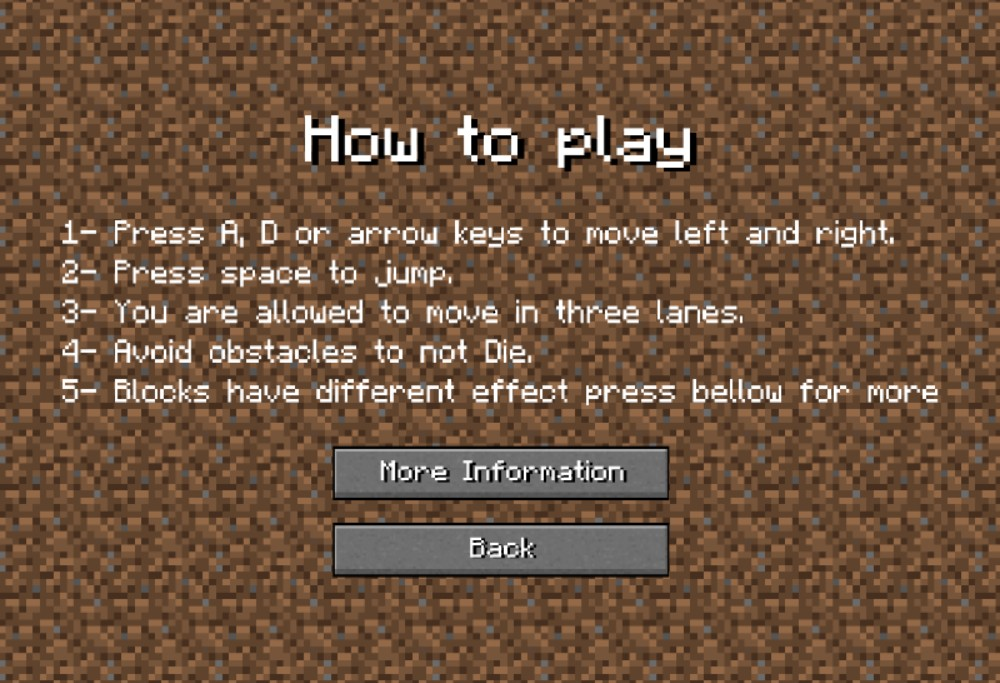

# Minecraft Infinite Runner Game (Unity | C#)


An infinite runner game built in Unity and styled with **Minecraft assets**.  
The player must dodge obstacles, collect items, and survive as long as possible while your fuel gradually decreases.  

---

## 🎮 Features
- Endless running gameplay loop.  
- Player movement with smooth character animations.  
- Randomly generated ground blocks with different effects.  
- Collision detection with obstacles and items.  
- Increasing difficulty over time.  

---

## 🕹️ Controls
- **Arrow Keys / WASD** → Move the character  
- **Spacebar** → Jump  
- **Esc** → Pause  

---

## 📸 Screenshots
You can add screenshots here once uploaded to the repo:

```markdown
(Images/HowToPlay2.jpg)


## 🙌 Credits

- Developed by **Hazem Sherif** (Cairo, Egypt).  
- Assets inspired by **Minecraft** (© Mojang Studios / Microsoft).  
  - ⚠️ These assets are **not included** in this repository.  
- Built with **Unity Game Engine** and **C#**.  


